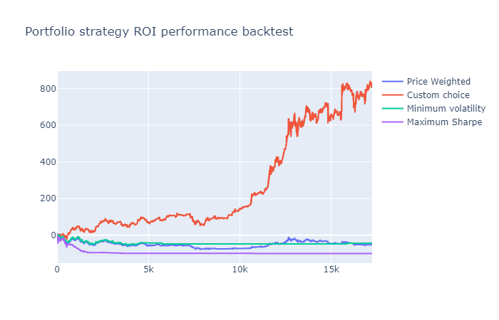
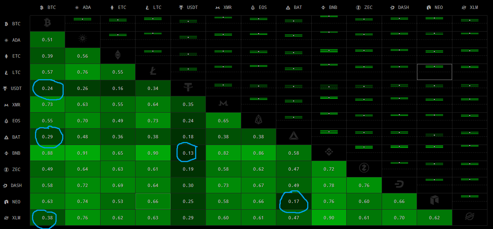

# Binance-Balancer - create your own ETF
Portfolio re-balancer for binance. Herein I provide a script to automate digital asset portfolio re-balance at user specified intervals (defaults to every hour). Note this is long only spot portfolio.

# Why diversify ?

Diverse investments mitigate risk of loss and can offer significant return improvements over any single asset. The dawn of crypto enables anyone to set up their own portfolio at near zero cost. Moreover, I present tools to enable anyone to automate re-balancing at any interval, based on manually pre-defined allocations.

# Why manually pre-defined ?

Informed human intuition outperforms risk models by an order of magnitude. Here is an excerpt of our performance stress test results of varying portfolio strategies from the same basket of crypto's over the last 2 years, re-balancing hourly.



Y axis is % Return On Investment

X axis is number of hours since the start (2 years ago)

# Which to choose ?

Higher market cap coins offer more safety. After that, it becomes a personal choice based on foreseen security, value, utility, fees, speed. Once you have picked your top 10, say, you can see their correlations. 



Highlighted in blue are the low correlations we are looking for. Note that in this case all correlations are positive. Since they are all in the currency class this is not unexpected but highlights the importance of investing also across asset classes.

From the above example, we can choose a simple portfolio:


# How to setup my ETF ?

Steps to get started:

1. [Download and install python framework](https://www.python.org/downloads/)
2. [Set up a Binance account](https://www.binance.com/en/register?ref=LTUMGDDC)
3. [Generate API keys](https://www.binance.com/userCenter/createApi.html)
4. Fund your Binance account
5. Download this binance balancer script
6. Edit API keys in binance_balancer.py
7. Edit your configuration:

```python
lastweights = {     "BAT":0.1,         "XLM":0.1,     "BNB":0.1,      "BTC": 0.4,       "USDT": 0.3 }
```
Install dependencies:

```
pip install python-binance
```
Run the script (it will automatically re-balance for you every hour):

```
python binance-balancer.py
```

# Final thoughts 

Hopefully, you have found my software of value. I offer my extensive testing, results and software for your benefit. That is for financial sovereignty of the populous. Please consider donating.

# Karma Jar
BTC - 112eMCQJUkUz7kvxDSFCGf1nnFJZ61CE4W

LTC - LR3BfiS77dZcp3KrEkfbXJS7U2vBoMFS7A

ZEC - t1bQpcWAuSg3CkBs29kegBPXvSRSaHqhy2b

XLM - GAHK7EEG2WWHVKDNT4CEQFZGKF2LGDSW2IVM4S5DP42RBW3K6BTODB4A Memo: 1015040538

Nano - nano_1ca5fxd7uk3t61ghjnfd59icxg4ohmbusjthb7supxh3ufef1sykmq77awzh

XRP - rEb8TK3gBgk5auZkwc6sHnwrGVJH8DuaLh Tag: 103535357

EOS - binancecleos Memo: 103117718

# Recommended links
Getting started - [Coinbase](https://www.coinbase.com/join/bradle_6r)

Portfolio balance - [Binance](https://www.binance.com/en/register?ref=LTUMGDDC)

Futures trading - [Deribit](https://www.deribit.com/reg-8106.6912)

Cold wallet - [Atomic](https://atomicWallet.io?kid=12GR52)
